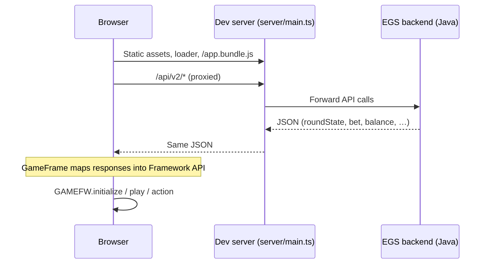

# Server and client interaction (Dragon Solitaire)

This document describes how the **EGS / RGS backend**, the **Apila development server**, **GameFrame** (`window.casino.framework`), and the **game client** work together for initialization and betting. The server contract is owned by the backend team; the client adapts to the payloads documented in `response/placebet.json` and `response/action.json`.

## High-level architecture



- **Development**: `yarn start` runs `server/main.ts`, which proxies `/api/v2/*` to the configured EGS URL (`http://localhost:4567` by default, or a remote backend with `--remote`).
- **GameFrame** (loaded by `@apila/casino-loader`) exposes `GAMEFW` in `src/framework.ts` as `CASINONS.framework`. It wraps HTTP/WebSocket traffic to the RGS and presents a typed **Framework** API to the game.

## Framework API used by this game

| Framework method | Typical RGS operation | Used in client |
|------------------|----------------------|----------------|
| `initialize()` | Session / recovery | `BackendUtil.init()` |
| `play(bet, action, params)` | Start round (e.g. `action: 'deal'`) | `BackendUtil.play()` (spin / deal) |
| `action(name, params)` | Mid-round steps (e.g. `pick`) | `BackendUtil.solitairePick()` |
| `complete()` | End round / settle | `BackendUtil.complete()` |

`RoundData` in `@apila/casino-frame` types expects a field **`round`** for the solitaire snapshot. Some EGS responses expose the same object as **`roundState`**. The client normalizes both in `BackendUtil.roundFromFrameworkPayload()` so validation and rendering work regardless of which name the pipeline uses.

## Payload shape (from your samples)

Top-level fields (see `response/placebet.json`, `response/action.json`):

- **`roundState`**: Full solitaire state for the client (`rounds`, `picks`, `wastePile`, `openCards`, `foundationTops`, `faceDownCounts`, `featureStatus`, `hash`, `state`, `v`, flags such as `canGamble`, `winFactor`, etc.).
- **`roundId`**, **`step`**, **`bet`**, **`gameSessionId`**, **`balance`**: Session and economy metadata.

Inside **`roundState.rounds`**, each entry can include:

- **`roundType`**: e.g. `"deal"` or `"pick"`.
- **`winFactor`**: Numeric win factor for that step.
- **`move`**: `{ from, to, count }` (stock, stacks, foundation, waste).
- **`moved`**: Cards involved in that step (`rank`, `suit`, `isJoker`).

The TypeScript schema lives in `src/config/backend-types.ts` (`RoundStateSchema`, extended `RoundSchema` for `move` / `moved`). To verify samples locally:

```bash
npx ts-node -T script/validate-round-response-samples.ts
```

## Client game flow (spin → placebet → board)

1. **`Main.initialize()`** (`src/game-loop.ts`) configures GameFrame, then **`BackendUtil.init()`** runs **`GAMEFW.initialize()`**. If the reply includes an active round, it is validated and cached for recovery (`BackendUtil.restoreGameState()` in `Preload`).
2. State machine starts in **`Preload`** → **`CarouselIntro`** / **`PreloadDone`** → **`Ready`**.
3. **`Ready`** waits for the player to press play if needed, then enters **`BasegameRound`**.
4. **`BasegameRound`** calls **`BackendUtil.play(GAMEFW.state().bet)`**, which invokes **`GAMEFW.play(..., 'deal', {})`**. That corresponds to the **placebet / deal** response (same shape as `response/placebet.json`).
5. On success, **`GAME.cards.renderSolitaireBoard(round)`** lays out the board from `roundState` fields.
6. While **`round.state === 'pick'`** and **`picks`** is non-empty, the player chooses moves; each selection calls **`BackendUtil.solitairePick(move)`** → **`GAMEFW.action('pick', move)`**, updating the round until the server moves to **`result`** (see `response/action.json` for a terminal snapshot with a long `rounds` history).

## Files to read when extending parsing

- **`src/util/backend-util.ts`**: All Framework calls and `RoundStateSchema` assertions.
- **`src/config/backend-types.ts`**: Superstruct schemas aligned with server JSON.
- **`src/states/BasegameRound.ts`**: Connects placebet to the solitaire UI loop.
